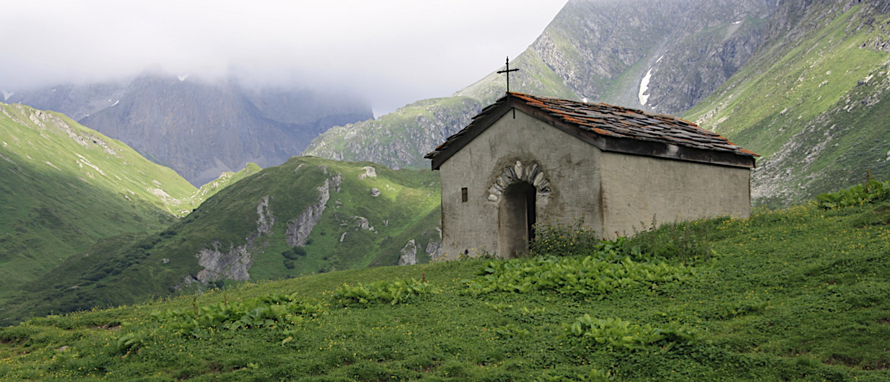
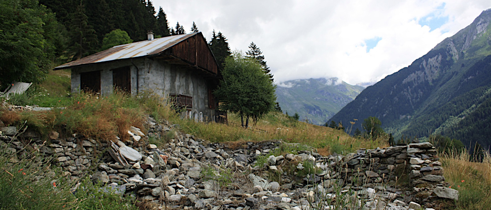

#Scratch Pad

This document contains all the snippets you need with explanations.

###Big heading sections with full width/height background images

The img_container class sets up the dimensions of the element.

```
<section class="img_container">

</section>
```

Add an additional class name, in this case "dogs" so that you can define a background image in CSS:

```
<section class="dogs img_container">

</section>
```
To accompany this, add a new CSS style in style.css:

```
.dogs {
  background: url(../img/dog_pic.jpg);
  background-size: cover;
  background-attachment: fixed;
}
```

You can then put content inside this section, for example a header with headings:
```
<section class="dogs img_container">
  <header>
    <h1>Some content</h1>
  </header>
</section>
```

But it doesn't need to be headings, it could be blockquote, or anything. This may require additional CSS.

###Content sections

A content section gives you a column to put your text and any other media.

```
<section class="content">
  //Your content
</section>
```

This is straight forward.

###Big heading sections with full width/height and background colour

As well as headers with background images, you can have just a colour.

```
<section class="color_conatiner">

</section>
```
The "color_conatiner" class sets up the section's dimensions. The addition of your own class e.g. "bg_green" allows you to set it's colour:
```
<section class="color_conatiner bg_green">

</section>
```
And in CSS, create a new style:
```
.bg_green {
  background: #bada55;
}
```
Add the header and h1 as with the img_container.

###Full width videos

There are two ways of implementing full width video: 

####HTML5 video
This can be seen in the HTML5Video_test.html file.

This method requires you to place an mp4 video file in your web directory (the img folder is a good place).

First create a section and give it a class name "video_container" - this sets up the dimentions of the section:
```
<section class="video_container" id="_htmlVid">

</section>
```
The id="_htmlVid" allows us to trigger play from scrolling later on. 

A ```<video>``` element is used and the mp4 video linked:
```
<section class="video_container">
  <video src="img/trailer.mp4"></video>
</section>
```
The ```<video>``` element can have several attributes to change it's characteristivs e.g.
* **loop**  loops the video
* **controls** turns on the control interface e.g. play/stop/seek
* **id** gives the video element a unique name so it can be controlled in JavaScript

So for a simple video that the user controls, just use:
```
<video src="img/trailer.mp4" controls></video>
```
```
<video src="img/trailer.mp4" loop id="foo"></video>
```

The code to control the video csan be found in index.js: 
```
$(function () {
  // build scene
  var scene = new ScrollMagic.Scene({triggerElement: "#_htmlVid", duration: 500})
  // var htmlVideo = document.getElementById("foo")[0];

  .on("enter", function () {
    document.getElementById('foo').play();
  })
  .on("leave", function () {
    document.getElementById('foo').pause();

  })
  .addTo(controller);
});
```


####Youtube Video at full width/height
The section uses the class "video_container" which sets the dimensions.
```
<section class="video_container">

</section>
```
Youtube is initialised using Javascript, so an additional div is required.

```
<section class="video_container">
  <div id="player"></div>
</section>
```

Lastly, the video playback is controlled by Javascript so an ID is required.
```
<section class="video_container" id="_video">
  <div id="player"></div>
</section>
```
In index.js, the Youtube video ID is required e.g. youtu.be/_tRKl0tSOKs0_
```
videoId: 'tRKl0tSOKs0'
```


###Image carousel
[Owl Carousel](http://smashingboxes.github.io/OwlCarousel2/) has been integrated. Simply create some HTML like:

```
<div class="owl-carousel">
  <div>  </div>
  <div>  </div>
  <div>  </div>
</div>

```
Noting the class name given e.g. "owl-carousel". Then initialise the carousel in index.js.
```

$(document).ready(function(){
  $(".owl-carousel").owlCarousel({
    items: 1,
    nav: true
  });

  $(".alps-carousel").owlCarousel({
    items: 1,
    dots: false,
    autoplay: true,
    animateOut: 'fadeOut'
  }); //

});
```

The above initialises two separate carousels, one with a class "owl-carousel" and the other "alps-carousel".

###Wow animations
[Animate.css](http://daneden.github.io/animate.css/) and [Wow.js](http://mynameismatthieu.com/WOW/) are integrated.

To initialise an animation when scrolled to, add the class "wow" and any of the classes listed on animate.css website to the element:
```
<header class="wow fadeInUpBig">

</header>
```
